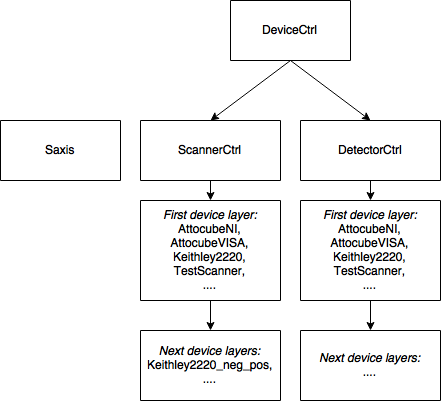

# Measurement libraries

Readme file by Raphael Proux (26/03/2018).

Libraries used for doing measurements – please note the `instruments` folder contains the libraries specifically written to communicate directly with an instrument.

## Mapper libraries

The mapper libraries are split in four different files:

* `mapper.py` contains the classes and programs to be called for measurements (like `XYScan.py`),

* `mapper_general.py` should nearly never be changed (only for some architecture change). It contains a generic `DeviceCtrl` class which serves as a generic base for scanners and detectors classes,

* `mapper_detectors.py` defines the device classes specific to detectors (`DetectorCtrl` based on the parent class `DeviceCtrl` from `mapper_general.py`). This is the file to modify to add a new detector.

* `mapper_scanners.py` defines the device classes specific to scanners (`ScannerCtrl` based on the parent class `DeviceCtrl` from `mapper_general.py`). This is the file to modify to add a new detector. 

### `mapper_general.py`, `mapper_detectors.py` and `mapper_scanners.py` libraries

This series of libraries define `DeviceCtrl` classes which provide a standard interface to drive all types of devices used for measurements.

The `DeviceCtrl` classes inherit each other this way:

.

`DeviceCtrl` serves as a generic base used for any device and will define default attributes like `string_id`, error handling functions and a `close()` function.

From `DeviceCtrl` are defined `ScannerCtrl` and `DetectorCtrl`:

* `DetectorCtrl` is used for a device which reads measurement values, like a multimeter, a camera, a photodetector, etc. It will define specific attributes like `delay_after_readout` and `delay_state_check` and specific methods, like `readout()`, `is_ready()` and `first_point()`.

* `ScannerCtrl` is used for a device which should be driven to a measurement point, like a motor controller, a voltage power supply, a laser, etc. It will define specific attributes like `number_of_axes` and specific methods, like `move()` and `get()`.

* `Saxis` is a class specifically defined for scanners (`Saxis`= Scanner axis). It does not directly inherit from `ScannerCtrl`, but is tighlty related to it as it will construct the objects summoned by `__getitem__()` and will then have the `move()` and `get()` functions manually inherited from its parent `ScannerCtrl`-type class. This allows for calls like `scanner[1].move(22)` instead of `scanner.move(target=22, axis=1)`. In this example, `scanner[1]` is an `Saxis` object which can be passed as an independent object. The `ScannerCtrl` object can also be looped on with a for-loop to address all the individual axes. Finally, `initialize()` and `close()` functions are integrated to `Saxis` and just call the ones of their parent `ScannerCtrl`. A redundancy flag prevents multiple initializations or terminations of the communication so there is no issue in calling `close()` or `initialize()` repeatedly.

__Important note:__ in this library, the terms `channel`, `axis` and `s-axis` have specific and different meanings:

* `channel` designates a variable used to identify physically the channel to move or read on the device – by extension we also will say “channel” for the physical channel being modified or moved on the device. It usually is a string or an integer, but it could be something else. This variable is passed directly to the instruments library which handles the communication with the device.

* `axis` is an integer which identifies an `s-axis` (see below) inside the `ScannerCtrl` class. For a usual scanner device where each channel is controlled independently, then `axis` corresponds to the indices of the list of `channels`. `axis` is used to tell the `ScannerCtrl` object which `s-axis` it is supposed to talk to.

* `s-axis` is the abbreviation for "Scanner-axis" and is built upon the `Saxis` class. The `s-axis` is a virtual channel, it is identified by its `axis` number inside the `ScannerCtrl` object which generated it, but can be used exclusively and independently from the `ScannerCtrl` object, once it has been constructed. In particular, an `s-axis`

### `mapper.py` library

This file contains the measurement classes themselves. For now, there is only one measurement class called `XYScan`.

#### `XYScan` class